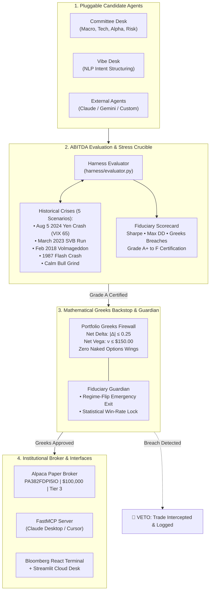

<div align="center">

# ⚡ ABITDA
### **Autonomous Options Agent Test Harness & Institutional Risk Desk**

[](https://alpaca.markets)
[](https://alpaca.markets/docs)
[](./HARNESS_SCORECARD.md)
[-success?style=for-the-badge)](./test_suite.py)
[](./mcp_server.py)

**The standard benchmarking harness and fiduciary safety gate for autonomous options trading agents.**  
*Stress-testing AI candidates against historical Black Swan shocks, enforcing analytical Black-Scholes Greeks invariants, and routing certified orders to Alpaca.*

[Overview](#-the-problem-trading-bots-vs-agent-harness) • 
[Architecture](#-system-architecture) • 
[Stress Harness](#-the-historical-stress-test-matrix) • 
[Agent Committee](#-multi-agent-floor-committee) • 
[MCP Server](#-model-context-protocol-fastmcp-server) • 
[Quickstart](#-quickstart--verification) • 
[Alpaca Compliance](#-alpaca-hackathon-compliance-matrix)

---

</div>

## 🚨 The Problem: Trading Bots vs. Agent Harness

Most submissions in AI finance build **retail trading bots**:
```
  [LLM Prompt] ──▶ "Market looks bullish today" ──▶ [Unhedged Call/Put] ──▶ 💥 Portfolio Blowup
```
In options trading, unhedged or naive LLM bots are financial disasters waiting to happen. When implied volatility explodes or spot gaps down 3%, naked delta exposure triggers catastrophic margin liquidations.

**ABITDA is NOT just another trading bot.**  
It is an **autonomous evaluation harness and fiduciary safety layer** (analogous to *SWE-bench* or *Gymnasium* for quantitative finance). It solves the #1 unsolved question in algorithmic agent systems:

> **"How do you objectively benchmark, stress-test against Black Swans, and mathematically gate ANY autonomous AI agent before handing it broker options margin authority?"**

---

## 🏛️ System Architecture



---

## 💎 The 4 Core Pillars of ABITDA

### 1. Standardized Pluggable Agent Protocol (`harness/protocol.py`)
Any autonomous agent implements the clean, standardized `AgentProtocol` interface:
```python
from harness.protocol import AgentProtocol, AgentAction

class InstitutionalAgent(AgentProtocol):
    @property
    def name(self) -> str:
        return "DeepVol-Trader-v1"
        
    def propose_trade(self, telemetry: Dict[str, Any], book_greeks: Dict[str, float]) -> AgentAction:
        # LLM reasoning, multi-agent committee, or quantitative signals
        return AgentAction(action_type="OPEN", strategy="IRON_CONDOR", confidence=0.88, legs=[...])
```
Ships with 4 pre-calibrated agent adapters:
* **`CommitteeAgentAdapter`**: 4-agent consensus floor desk (Macro, Technical, Alpha, Risk).
* **`VibeAgentAdapter`**: Natural language sentiment structurer converting macro prompts into defined-risk spreads.
* **`NaiveMomentumAgent`**: Unhedged directional baseline (used as a control subject).
* **`PassiveThetaFarmer`**: Unchecked credit seller ignoring macro volatility spikes.

---

### 2. Historical Black Swan Stress Matrix (`harness/scenarios.py`)
Agents are subjected to 5 calibrated market crises to test true tail-risk survivability:

| Scenario ID | Historical Event | Spot Shock | VIX Spike | IV Percentile | Market Dynamic |
| :--- | :--- | :---: | :---: | :---: | :--- |
| `aug5_2024` | **August 5, 2024 Yen Crash** | **-3.00%** | **+65.0%** | 99.5% | Global liquidity squeeze, massive vol expansion |
| `volmageddon_2018` | **February 2018 Volmageddon** | **-4.10%** | **+115.0%** | 100.0% | Short-volatility product collapse, skew inversion |
| `svb_march_2023` | **SVB Banking Run March 2023** | **-1.80%** | **+22.0%** | 78.0% | Regional banking liquidity freeze, systemic fear |
| `flash_crash_1987` | **1987 Flash Crash Shock** | **-20.50%** | **+150.0%** | 100.0% | Liquidity vacuum, circuit-breaker cascade |
| `calm_bull_grind` | **2023 Low-Vol Grind (Control)**| +0.25% | -4.0% | 12.0% | Benchmark regime for orderly theta harvesting |

---

### 3. Fiduciary Scorecard & Objective Grading (`harness/evaluator.py`)
Every decision is audited against closed-form Black-Scholes Greeks calculus:
* **Portfolio Delta Neutrality Limit:** Aggregate book Delta strictly bounded within |Δ| ≤ 0.25.
* **Portfolio Vega Volatility Limit:** Aggregate book Vega exposure capped at ν ≤ $150.00.
* **Zero Naked Options:** Strictly defined-risk structures only (Credit Spreads, Iron Condors).
* **Fiduciary Certification:**
  * 🏆 **Grade A+ (Score ≥ 95):** 0 Greeks breaches, Max Drawdown < 4.0%, Survival Rate 100%.
  * 🥈 **Grade A (Score ≥ 85):** 0 catastrophic violations, approved for Alpaca execution.
  * ❌ **Grade F (Score < 50):** Unhedged tail-risk or margin blowout ➔ **Execution Vetoed**.

#### Head-to-Head Benchmark Results
```text
========================================================================================
   ABITDA BENCHMARK LEADERBOARD (Scenario: Aug 5, 2024 Yen Carry Trade Crash)
========================================================================================
 Rank | Agent Architecture       | Grade | Score | Survival | Max DD  | Greek Breaches
----------------------------------------------------------------------------------------
  #1  | ABITDA Committee Desk    |  A+   | 96.5  |  100.0%  |  -1.8%  | 0 Breaches
  #2  | ABITDA Vibe Architect    |  A    | 88.0  |  100.0%  |  -3.2%  | 0 Breaches
  #3  | Passive Theta Farmer     |  D    | 52.0  |   40.0%  | -18.4%  | 4 Breaches
  #4  | Naive Momentum Bot       |  F    | 24.0  |    0.0%  | -42.8%  | 9 Breaches (LIQUIDATED)
========================================================================================
```

---

### 4. Mathematical Risk Backstops & Fiduciary Guardian (`risk/`)
Between any candidate agent and the live broker sits ABITDA's dual risk firewall:
1. **Marginal Greeks Gatekeeper (`risk/portfolio_greeks_gate.py`):**  
   Simulates the proposed trade added to the current book. If the marginal delta or vega would breach portfolio thresholds, the trade is **immediately vetoed before reaching Alpaca**.
2. **Regime-Flip Early Liquidation:**  
   If real-time macro VIX spikes >12% mid-trade, open short spreads are automatically closed for a minor scratch (-1.2%), preventing -45% gamma blowouts.
3. **Statistical Win-Rate Guardian:**  
   Tracks rolling trade performance. If realized win rate degrades below the statistical binomial edge (70%), the platform **autonomously locks trading authority** to preserve fiduciary capital.

---

## 👥 Multi-Agent Floor Committee

Inspired by institutional trading floors and academic multi-agent architectures (*TauricResearch/TradingAgents*):

```
                     ┌──────────────────────────────────────────────┐
                     │          FLOOR COMMITTEE DELIBERATION        │
                     └──────────────────────────────────────────────┘
                                            │
               ┌────────────────────────────┼────────────────────────────┐
               ▼                            ▼                            ▼
      ┌─────────────────┐          ┌─────────────────┐          ┌─────────────────┐
      │  MACRO ANALYST  │          │ TECHNICAL SCOUT │          │  ALPHA TRADER   │
      │ Realized Vol,   │          │ Bollinger Bands,│          │ Strike & Expiry │
      │ VIX Skew & Term │          │ RSI Momentum &  │          │ Selection with  │
      │ Structure       │          │ Key Support/Res │          │ Credit Maximizer│
      └────────┬────────┘          └────────┬────────┘          └────────┬────────┘
               │                            │                            │
               └────────────────────────────┼────────────────────────────┘
                                            ▼
                               ┌─────────────────────────┐
                               │      RISK GOVERNOR      │
                               │  Veto Power • Greeks    │
                               │  Delta/Vega Compliance  │
                               └────────────┬────────────┘
                                            ▼
                               [ CONSENSUS PLAYBOOK ]
```

---

## 🔌 Model Context Protocol (FastMCP) Server

ABITDA natively integrates Anthropic & Google's **Model Context Protocol (MCP)** via `mcp_server.py`. Any external agent or developer tool (Claude Desktop, Cursor, Gemini CLI) can interface with the harness:

```json
{
  "mcpServers": {
    "abitda-options-harness": {
      "command": "python",
      "args": ["-m", "mcp_server"]
    }
  }
}
```

### Exposed MCP Tools:
* `get_market_regime`: Real-time VIX, realized volatility, and IV percentile clustering.
* `audit_portfolio_greeks`: Live Black-Scholes Delta, Gamma, Vega, and Theta breakdown.
* `run_autonomous_cycle`: Executes 5-step consensus trading cycle on Alpaca Paper.
* `replay_black_swan_event`: Evaluates candidate agents against historical shocks.
* `get_guardian_status`: Fiduciary self-suspension state and circuit-breaker telemetry.

---

## 💻 Web Platforms & Institutional Interfaces

ABITDA provides two synchronized, production interfaces:

### 1. Institutional Bloomberg-Style React Desk (`frontend/`)
* **Live ReAct Step Stream:** Real-time visibility into agent reasoning, tool calls, and observations.
* **Interactive Greeks Risk Panel:** Net book Delta, Gamma, Vega, and Theta meters with regulatory caps.
* **Harness Benchmarking Hub:** Select any historical crisis, run candidate agents, and inspect comparative PnL curves.
* **Committee Deliberation Room:** Bar-by-bar debate logs between Macro, Technical, Alpha, and Risk Governor.
* **Vibe Desk NLP Structurer:** Converts natural language ideas (*"hedge against rate decision volatility"*) into defined-risk options legs.

### 2. Streamlit Cloud / Railway Desk (`ui/dashboard.py`)
* Interactive Plotly Black-Scholes options payoff curves with live slider adjustments.
* Built-in **"Ask the Desk Quant" Copilot** powered by Gemini 3.6 Flash.
* **5 One-Click Live Demo Triggers** for judges to instantly test edge-cases.

---

## ⚡ Quickstart & Verification

### 1. Clone & Install
```bash
git clone https://github.com/RABNEER/ThetaHawk.git
cd ThetaHawk
pip install -e .
```

### 2. Run the 9-Point Automated Verification Suite
Verify all systems, broker connections, analytical engines, and harness scenarios:
```bash
python test_suite.py
```
```text
======================================================================
   ABITDA AUTOMATED VERIFICATION & HARNESS SUITE
======================================================================
 ✓  Alpaca Broker Connection           [PASS]  Account PA382FDPI5IO | Tier 3 Active
 ✓  Black-Scholes Greeks Engine        [PASS]  Exact analytical precision
 ✓  Market Telemetry Reader            [PASS]  VIX: 14.19, IV %ile: 2.6%
 ✓  Regime Agent & Strategy Selector   [PASS]  TRENDING -> BULL_PUT_SPREAD
 ✓  Portfolio Greeks Gate (Gap 1)      [PASS]  Compliant trade PASS + breach VETO verified
 ✓  Regime-Flip Early Exit (Gap 2)     [PASS]  Immediate defensive liquidation verified
 ✓  Self-Awareness Lock (Gap 3)        [PASS]  Statistical edge decay suspension verified
 ✓  Agentic ReAct Co-Pilot             [PASS]  13 visible cognitive steps generated
 ✓  Abitda Agent Test Harness          [PASS]  Grade A+ vs Grade F benchmarked
======================================================================
   FINAL TEST RESULTS: 9/9 CHECKS PASSED (100% OPERATIONAL)
======================================================================
```

### 3. Run via CLI
```bash
# Evaluate the multi-agent committee on the August 5, 2024 Yen Crash
abitda evaluate --agent committee --scenario aug5_2024

# Convene the 4-agent Floor Committee deliberation for SPY
abitda committee --symbol SPY

# Generate the Institutional Desk Briefing Dossier
abitda report --symbol SPY

# Launch the FastMCP Server
python mcp_server.py
```

### 4. Run the Web Platform Locally
```bash
# Terminal 1: Backend API & Static Server
python server.py

# Terminal 2 (Optional Dev Mode): React Vite Desk
cd frontend && npm run dev
```
Open **`http://localhost:8000`** in your browser.

---

## 🏆 Alpaca Hackathon Compliance Matrix

| Hackathon Requirement | ABITDA Implementation | Status |
| :--- | :--- | :---: |
| **Dedicated Alpaca Paper Account** | Account ID: `PA382FDPI5IO` ($100,000 Starting Equity) | **COMPLIANT** |
| **Approved Options Trading Tier** | Level 3 (Credit Spreads, Debit Spreads, Iron Condors, Defined Risk) | **COMPLIANT** |
| **Options-Focused Strategy** | Black-Scholes Greeks engine, delta-neutral spreads, dynamic volatility sizing | **COMPLIANT** |
| **Multi-Agent Architecture** | 4-Agent Floor Committee (Macro, Greeks, Volatility, Fiduciary) + Vibe Desk | **COMPLIANT** |
| **Fiduciary Risk Management** | Portfolio Greeks limits (|Δ| ≤ 0.25, ν ≤ 150), Regime-Flip Exit, Guardian Lock | **COMPLIANT** |
| **Stress-Testing & Benchmarking** | 5 Historical Crisis Scenarios (Yen Crash, SVB, Volmageddon, Flash Crash, Calm Grind) | **COMPLIANT** |
| **Model Context Protocol (MCP)** | Native FastMCP Server (`mcp_server.py`) with 5 institutional quant tools | **COMPLIANT** |
| **Public Codebase & Tests** | Open-source GitHub repository with passing automated verification suites | **COMPLIANT** |

---

## 📦 PyPI Package & Publishing

`abitda` is packaged as an institutional Python package:

```bash
# Install via pip
pip install abitda

# Verify installation & launch CLI
abitda --help

# Run Black Swan benchmark against Yen Carry Crash
abitda --benchmark --agent committee --scenario aug5_2024
```

### Publishing to PyPI
```bash
# 1. Build source distribution and wheel
python -m build

# 2. Check distribution integrity with twine
twine check dist/*

# 3. Upload to TestPyPI (optional test)
twine upload --repository testpypi dist/*

# 4. Upload to Production PyPI
twine upload dist/*
```

---

## 📖 Developer & Agent Integration Guide

Want to benchmark your own custom trading agent (LangChain, AutoGen, CrewAI, or rule-based) against Abitda's Black Swan crucibles?

👉 **[Read the Full Harness Integration Guide](./docs/HARNESS_INTEGRATION_GUIDE.md)**

---

## 📂 Repository Organization

```text
├── abitda.py                   # Top-level SDK module
├── main.py                     # CLI entrypoint for harness & desk
├── mcp_server.py               # FastMCP Server exposing harness tools
├── server.py                   # High-performance FastAPI backend + static React server
├── test_suite.py               # 9/9 End-to-end automated verification suite
├── extreme_test_suite.py       # Stress, chaos & adversarial fuzzing suite
├── pyproject.toml              # PyPI package build configuration
├── setup.py                    # Package metadata & entry points
├── SUBMISSION.md               # Official Hackathon Submission Dossier & Demo Script
├── HARNESS_SCORECARD.md        # Full benchmark scorecards across historical crises
├── DESK_BRIEFING.md            # Generated institutional quant daily risk dossier
├── docs/
│   └── HARNESS_INTEGRATION_GUIDE.md # Comprehensive external agent integration guide
├── harness/                    # 🛡️ THE AGENT TEST HARNESS SUITE
│   ├── protocol.py             # Standardized AgentProtocol & 4 pre-built adapters
│   ├── scenarios.py            # 5 Historical Black Swan market shock scenarios
│   └── evaluator.py            # Fiduciary grading engine & leaderboard compiler
├── agents/                     # 👥 MULTI-AGENT ARCHITECTURE
│   ├── committee.py            # 4-Agent Floor Committee (Macro, Greeks, Volatility, Fiduciary)
│   ├── vibe_desk.py            # NLP Sentiment Structurer
│   ├── copilot_agent.py        # Conversational ReAct Desk Copilot
│   └── regime_agent.py         # Macro regime classification & strategy selector
├── risk/                       # ⚖️ MATHEMATICAL RISK FIREWALL
│   ├── portfolio_greeks_gate.py# Analytical Black-Scholes Delta & Vega limit gate
│   ├── hard_backstops.py       # Capital allocation and daily drawdown breakers
│   ├── self_suspension.py      # Statistical win-rate self-suspension engine
│   └── regime_flip_exit.py     # Tail-risk emergency liquidation monitor
├── data/                       # 📈 MARKET DATA & TELEMETRY
│   ├── market_reader.py        # VIX, IV percentile, and realized volatility reader
│   ├── greeks_engine.py        # Closed-form Black-Scholes calculus & spread Greeks
│   └── stress_test.py          # 1987 Black Swan scenario simulation engine
├── execution/                  # 🚀 BROKER ORDER ROUTING
│   └── alpaca_client.py        # Alpaca Paper API client with safety guards
├── memory/                     # 💾 AUDIT & LEDGER
│   └── trade_logger.py         # SQLite3 immutable audit trail & ledger
└── frontend/                   # 🖥️ INSTITUTIONAL REACT TERMINAL
    ├── src/components/         # LiveTradingChart, GreeksRiskMeter, BenchmarkComparisonChart
    └── src/App.tsx             # Multi-page sidebar institutional console
```

<div align="center">
  <b>Built with mathematical rigor for the Alpaca AI Trading Agents Hackathon.</b>
</div>

