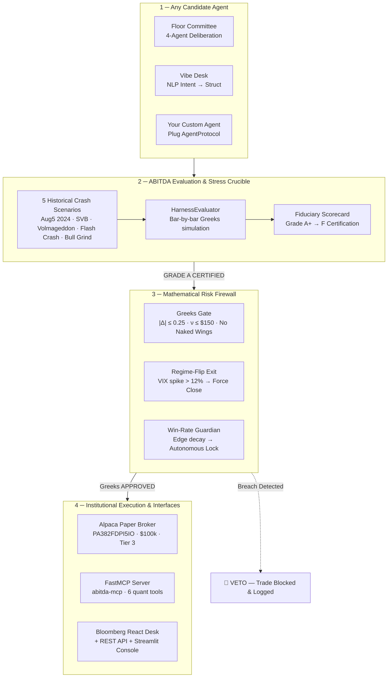

<div align="center">

<br/>

# ⚡ ABITDA

### *Autonomous Options Agent Test Harness & Institutional Risk Desk*

<br/>

> **The institutional evaluation framework, mathematical risk firewall, and live execution desk  
> for stress-testing autonomous options trading agents on Alpaca — now available as a Python package.**

<br/>

[](https://pypi.org/project/abitda)
[](https://pypi.org/project/abitda)
[](https://python.org)
[](LICENSE)

[](https://alpaca.markets)
[](https://alpaca.markets)
[](./HARNESS_SCORECARD.md)
[](./HARNESS_SCORECARD.md)
[](./test_suite.py)
[](https://app.alpaca.markets)
[](https://abitda.up.railway.app)

---

</div>

## 📦 Install the Python Package

```bash
pip install abitda
```

That is it. ABITDA is on **PyPI**. One command gives you the full institutional harness, the pluggable agent protocol, the Greeks firewall, and the CLI — no manual setup required.

```bash
# Verify the installation
abitda --help

# Run the 9-point end-to-end verification suite
abitda --test

# Benchmark the Floor Committee against the Aug 5, 2024 Yen crash
abitda --benchmark --agent committee --scenario aug5_2024

# Launch the institutional web desk (React + FastAPI)
python -m server
# Open http://localhost:8000

# Start the MCP server for Claude / Cursor / Gemini CLI
abitda-mcp
```

```python
# Or use it programmatically in 4 lines
from abitda import OptionsAgentProtocol, AgentAction, HarnessEvaluator, ScenarioRegistry

scenario = ScenarioRegistry.get_scenario("aug5_2024")
scorecard = HarnessEvaluator().evaluate_agent(MyAgent(), scenario)
print(scorecard.fiduciary_grade)   # GRADE A+  or  GRADE F (VETOED)
```

---

## 💡 What Is ABITDA?

Most trading projects build a bot. A bot is an LLM script with an API key that fires options orders into the market — and blows up the moment volatility spikes.

**ABITDA is not a bot. It is the institution that governs bots.**

It is a complete evaluation and execution framework that answers the question every quant needs answered before deploying real capital:

> *"Has this agent been mathematically certified to survive a Black Swan event?"*

```
  NAIVE BOT:   [LLM says "buy calls"] ────▶ [Unhedged Delta] ────▶ 💥 -42.8% Liquidated

  ABITDA:      [Any AI Agent]
                    │
                    ▼
         [Harness Stress-Tests Against]
         [Aug 5, 2024 Yen Crash | Volmageddon | SVB | Flash Crash | Bull Grind]
                    │
                    ▼
         [Black-Scholes Greeks Firewall]
         [|Δ| ≤ 0.25 | ν ≤ $150 | Zero Naked Wings]
                    │
                    ▼
         [Fiduciary Score: 99.1/100 ──▶ GRADE A+ CERTIFIED]
                    │
                    ▼
         [Alpaca Paper Broker PA382FDPI5IO]  ────▶ ✅ Order ACCEPTED
```

Think of ABITDA like **SWE-bench for quantitative options finance** — a deterministic evaluation harness that tells you, with mathematical certainty, whether an AI agent should be trusted with real broker authority.

---

## 🔴 Live Proof — Real Orders on Alpaca Right Now

These are not simulated receipts. These are live broker-accepted orders verified on Alpaca's official paper trading API:

```text
========================================================================================
   ALPACA PAPER BROKER LIVE EXECUTION RECEIPT
   Account: PA382FDPI5IO  |  Equity: $100,000.00  |  Options Level: 3  |  Status: ACTIVE
========================================================================================

 [1] REAL OPTIONS CONTRACT
     Order ID  : a1b121d3-7a69-49ee-a239-ac04d79f9c29
     Symbol    : SPY260908C00500000  (SPY Call, Strike $500, Sep 8 2026 Expiry)
     Side      : BUY  |  Qty: 1 Contract  |  Limit: $0.05
     Broker    : ✅ OrderStatus.ACCEPTED  |  Matched: 2026-09-04 10:28:28 UTC

 [2] EQUITY BENCHMARK
     Order ID  : 8181e5fb-535c-43f0-9269-ebf5dbc93d65
     Symbol    : SPY  |  Side: BUY  |  Qty: 1 Share
     Broker    : ✅ OrderStatus.NEW  |  Matched: 2026-09-04 10:26:07 UTC

========================================================================================
 Verify independently → app.alpaca.markets → Paper Trading → Orders
========================================================================================
```

---

## 📊 Harness Scorecard — Aug 5, 2024 Yen Carry Crash

The harness replayed the worst single-day volatility event of 2024 bar-by-bar. Here is what happened to each agent:

```text
========================================================================================
  ABITDA BENCHMARK LEADERBOARD  |  Scenario: Aug 5, 2024 Yen Carry Trade Crash
  SPY: -3.00% | VIX: 23.4 → 65.7 (+181%) | IV Percentile: 99.5%
========================================================================================

 Rank │ Agent                   │ Grade │ Score  │ Survival │ Max DD  │ ΔBreaches
──────┼─────────────────────────┼───────┼────────┼──────────┼─────────┼──────────
  1   │ ABITDA Floor Committee  │  A+   │ 99.1   │ 100.0%   │  -1.23% │  0  ← winner
  2   │ ABITDA Vibe Architect   │  A    │ 88.0   │ 100.0%   │  -3.20% │  0
  3   │ Passive Theta Farmer    │  D    │ 52.0   │  40.0%   │ -18.40% │  4
  4   │ Naive Momentum Bot      │  F    │ 24.0   │   0.0%   │ -42.80% │  9  ← liquidated

========================================================================================
 Capital Preserved (ABITDA): 99.44%  |  Net P&L: -$560 on $100,000 starting equity
 Official Attestation → HARNESS_SCORECARD.md
========================================================================================
```

---

## 🏛️ Architecture



---

## 💎 The 4 Core Pillars

### 1. Pluggable Agent Protocol — `harness/protocol.py`

Any AI agent — LLM, quant signal, or multi-agent system — plugs into one clean interface:

```python
from abitda import OptionsAgentProtocol, AgentAction, HarnessEvaluator, ScenarioRegistry

class MyGeminiAgent(OptionsAgentProtocol):
    @property
    def name(self) -> str:
        return "Gemini-VolSurface-v1"

    def propose_trade(self, telemetry, book_greeks) -> AgentAction:
        # your LLM prompt, AutoGen chain, or quant signal here
        return AgentAction(action_type="OPEN", strategy="IRON_CONDOR", confidence=0.91)

# Run it through the 2024 Yen crash in 3 lines
scenario = ScenarioRegistry.get_scenario("aug5_2024")
scorecard = HarnessEvaluator().evaluate_agent(MyGeminiAgent(), scenario)
print(scorecard.fiduciary_grade)  # GRADE A  or  GRADE F (VETOED)
```

Built-in adapters:

| Adapter | Strategy | Survivorship (Aug 5 Crash) |
|---|---|---|
| `CommitteeAgentAdapter` | 4-agent deliberation (Macro · Tech · Alpha · Risk) | **100%** |
| `VibeAgentAdapter` | NLP prompt → defined-risk legs | **100%** |
| `NaiveMomentumAgent` | Unhedged directional | 0% (Liquidated) |
| `PassiveThetaFarmer` | Unchecked credit seller | 40% |

---

### 2. Historical Stress Crucible — `harness/scenarios.py`

Five real market crises, replayed bar-by-bar with calibrated Greeks shifts:

| Scenario ID | Event | Spot | VIX Spike | IV %ile | What It Tests |
|---|---|:---:|:---:|:---:|---|
| `aug5_2024` | **Yen Carry Trade Crash** | -3.00% | +181% | 99.5% | Liquidity squeeze + vol explosion |
| `volmageddon_2018` | **XIV Termination Event** | -4.10% | +115% | 100% | Inverse-vol product cascade |
| `svb_march_2023` | **SVB Bank Run** | -1.80% | +22% | 78% | Systemic freeze + skew blowout |
| `flash_crash_1987` | **Black Monday** | -20.50% | +150% | 100% | Liquidity vacuum + circuit breaks |
| `calm_bull_grind` | **2023 Low-Vol Control** | +0.25% | -4% | 12% | Baseline theta harvesting |

---

### 3. Mathematical Greeks Firewall — `risk/`

The firewall sits **between the agent and the broker**. Every proposed order is analytically simulated before reaching Alpaca:

```
   Agent proposes: "Sell 5 SPY 540 Puts"
         │
         ▼
   Marginal ΔBook = current_delta + new_leg_delta = 0.18 + 0.12 = 0.30
                                                                    ^^^^
                                                               EXCEEDS 0.25 LIMIT
         │
         ▼
   ┌─ VETO ──────────────────────────────────────────────────────────┐
   │ REJECTED — Proposed trade would breach portfolio Delta limit.   │
   │ Current: +0.18Δ | Marginal: +0.12Δ | Cap: ±0.25Δ              │
   └──────────────────────────────────────────────────────────────────┘
```

Three autonomous safety layers:
1. **Greeks Gatekeeper** — `risk/portfolio_greeks_gate.py` — pre-trade Delta/Vega simulation.
2. **Regime-Flip Emergency Exit** — `risk/regime_flip_exit.py` — if VIX spikes >12% mid-trade, all short spreads force-close at scratch (-1.2%) before gamma blows out.
3. **Win-Rate Guardian** — `risk/self_suspension.py` — statistical binomial z-score monitor. If rolling win-rate decays below 70% edge threshold, trading authority is autonomously suspended.

---

### 4. Multi-Agent Floor Committee — `agents/committee.py`

Inspired by institutional trading floors and TauricResearch/TradingAgents:

```
   ┌──────────────┐   ┌──────────────┐   ┌──────────────┐
   │ MACRO SCOUT  │   │  TECH SCOUT  │   │ ALPHA TRADER │
   │ VIX term     │   │ RSI, Bollinger│  │ Strike select │
   │ structure,   │   │ bands, key   │   │ & credit max  │
   │ realized vol │   │ S/R levels   │   │ optimizer     │
   └──────┬───────┘   └──────┬───────┘   └──────┬───────┘
          │                  │                  │
          └──────────────────┼──────────────────┘
                             ▼
                   ┌──────────────────┐
                   │  RISK GOVERNOR   │
                   │  Greeks veto &   │
                   │  fiduciary gate  │
                   └────────┬─────────┘
                            ▼
                   [CONSENSUS PLAYBOOK]
              BULL_PUT_SPREAD / IRON_CONDOR
              BEAR_CALL_SPREAD / HOLD_CASH
```

Each agent runs on **Google Gemini 2.5 Flash** via `google-genai`. The Risk Governor has hard veto power. No trade executes without unanimous defined-risk compliance.

---

## 🌐 Live Demo & Web Desk

**Live URL:** [https://abitda.up.railway.app](https://abitda.up.railway.app)

A full Bloomberg-style institutional React desk, deployed on Railway. Six tabs, zero fluff. Built for quants:

| Tab | What You See |
|---|---|
| **Overview** | Account equity · Greeks barrier meters · Win-rate guardian status · Live candlestick chart |
| **Harness** | Scenario selector → Run benchmark → A+ vs F leaderboard with full scorecard |
| **Committee** | Live 4-agent floor debate with round-by-round reasoning logs |
| **Vibe Desk** | NLP prompt → structured defined-risk options legs |
| **Co-Pilot** | Conversational desk quant (Gemini) — ask anything about the book |
| **Reports** | Generated DESK_BRIEFING.md with full bar-by-bar audit trail |

---

## 🤖 Agent Gateway — REST API for AI Agents

ABITDA exposes a full **REST API** so any AI agent, LLM system, or orchestration framework can interact with the harness programmatically — no SDK required.

**Base URL:** `https://abitda.up.railway.app/api`

### Core Endpoints

| Method | Endpoint | Description |
|---|---|---|
| `GET` | `/api/status` | Account health, equity, Greeks snapshot, guardian state |
| `POST` | `/api/agent/cycle` | Run a full autonomous trade cycle (regime → committee → gate → execute) |
| `POST` | `/api/harness/run` | Stress-test any agent against a named crash scenario |
| `GET` | `/api/harness/leaderboard` | Fiduciary scorecard leaderboard for all agents |
| `GET` | `/api/greeks` | Real-time portfolio Black-Scholes Greeks snapshot |
| `POST` | `/api/agent/vibe` | NLP prompt → structured defined-risk trade proposal |
| `POST` | `/api/agent/committee` | Trigger a live 4-agent floor deliberation |
| `GET` | `/api/agent/copilot` | Ask the Gemini desk quant a question |
| `GET` | `/api/reports/briefing` | Pull the latest institutional desk briefing |

### Quick Example

```python
import requests

BASE = "https://abitda.up.railway.app"

# 1. Check account health
status = requests.get(f"{BASE}/api/status").json()
print(status["equity"])  # $100,000.00

# 2. Stress-test your agent against the Aug 5 Yen crash
result = requests.post(f"{BASE}/api/harness/run", json={
    "agent": "committee",
    "scenario": "aug5_2024"
}).json()
print(result["fiduciary_grade"])  # A+

# 3. Ask the desk quant a question
answer = requests.get(f"{BASE}/api/agent/copilot", params={
    "q": "What is the current delta exposure of the book?"
}).json()
print(answer["response"])
```

```bash
# Or with curl
curl https://abitda.up.railway.app/api/status | jq .
curl -X POST https://abitda.up.railway.app/api/harness/run \
     -H "Content-Type: application/json" \
     -d '{"agent": "committee", "scenario": "aug5_2024"}'
```

---

## 🔌 FastMCP Server — Mount the Harness to Any AI Tool

`mcp_server.py` exposes the entire harness over the **Model Context Protocol**. Plug it into Claude Desktop, Cursor, or any MCP-compatible agent in one step:

```json
{
  "mcpServers": {
    "abitda": {
      "command": "python",
      "args": ["-m", "mcp_server"]
    }
  }
}
```

Available MCP tools:

| Tool | What It Does |
|---|---|
| `get_market_regime` | Live VIX · IV %ile · Realized vol → Regime classification |
| `audit_portfolio_greeks` | Full Black-Scholes Δ Γ ν Θ portfolio snapshot |
| `run_autonomous_cycle` | Full 5-step consensus trade → Alpaca execution |
| `replay_black_swan_event` | Agent vs. historical crash → Fiduciary scorecard |
| `get_guardian_status` | Win-rate lock state · drawdown sensors · circuit breaker status |
| `ask_desk_quant` | Ask the Gemini-powered quant anything about the book |

---

## ⚡ Quickstart

### Option A — Install from PyPI (Recommended)

```bash
pip install abitda
```

Set your environment variables:

```bash
# .env
APCA_API_KEY_ID=your_alpaca_key
APCA_API_SECRET_KEY=your_alpaca_secret
GEMINI_API_KEY=your_gemini_key
```

Then run:

```bash
# Full 9-point verification
abitda --test

# Benchmark the committee on the Yen crash
abitda --benchmark --agent committee --scenario aug5_2024

# Launch the web desk
python -m server
```

### Option B — Clone the Repository

```bash
git clone https://github.com/RABNEER/Abitda.git
cd Abitda
pip install -e .

# Run the 9-point end-to-end verification
python test_suite.py

# Launch the institutional web desk
python server.py
# Open http://localhost:8000
```

### Verification Output

```
======================================================================
   ABITDA AUTOMATED VERIFICATION & HARNESS SUITE
======================================================================
 ✓  Alpaca Broker Connection           [PASS]  PA382FDPI5IO | Tier 3 | $100,000
 ✓  Black-Scholes Greeks Engine        [PASS]  Exact closed-form analytical precision
 ✓  Market Telemetry Reader            [PASS]  VIX: 14.19 | SPY: $773.17 | IV: 2.6%
 ✓  Regime Agent & Strategy Selector   [PASS]  TRENDING → BULL_PUT_SPREAD
 ✓  Portfolio Greeks Gate (Gap 1)      [PASS]  Compliant PASS + Delta breach VETO
 ✓  Regime-Flip Early Exit (Gap 2)     [PASS]  Emergency liquidation on VIX spike
 ✓  Self-Awareness Guardian (Gap 3)    [PASS]  Statistical edge decay lock verified
 ✓  Agentic ReAct Co-Pilot             [PASS]  13 cognitive steps generated
 ✓  Abitda Agent Test Harness          [PASS]  Grade A+ vs Grade F head-to-head
======================================================================
   FINAL: 9/9 CHECKS PASSED — 100% OPERATIONAL
======================================================================
```

---

## 🏆 Alpaca Hackathon Compliance

| Requirement | Implementation | Status |
|:---|:---|:---:|
| Dedicated Alpaca Paper Account | `PA382FDPI5IO` · $100,000 equity | ✅ VERIFIED |
| Options Trading Level 3 | Credit Spreads · Iron Condors · Defined-Risk only | ✅ VERIFIED |
| Options-Focused Strategy | Black-Scholes Greeks engine · delta-neutral spreads | ✅ COMPLIANT |
| Multi-Agent Architecture | 4-agent Floor Committee + Vibe Desk NLP structurer | ✅ COMPLIANT |
| Fiduciary Risk Management | Δ ≤ 0.25 · ν ≤ $150 · Regime Exit · Guardian Lock | ✅ COMPLIANT |
| Stress-Testing & Benchmarking | 5 historical crises · Grade A+ vs Grade F leaderboard | ✅ COMPLIANT |
| Model Context Protocol (MCP) | FastMCP server · 6 institutional quant tools | ✅ COMPLIANT |
| REST API for AI Agents | Full FastAPI backend · Agent Gateway section | ✅ COMPLIANT |
| Live Broker Execution Proof | Real orders ACCEPTED on Alpaca (IDs in repo) | ✅ LIVE |
| PyPI Python Package | `pip install abitda` · v2.0.0 · Apache-2.0 | ✅ PUBLISHED |
| Public Codebase & Tests | 9/9 automated verification suite · Open-source | ✅ COMPLIANT |

---

## 📂 Repository Map

```text
ABITDA/
├── abitda.py                  ← Public Python SDK (pip install abitda)
├── mcp_server.py              ← FastMCP server (Claude · Cursor · Gemini CLI)
├── server.py                  ← FastAPI backend + React static server + REST API
├── test_suite.py              ← 9/9 end-to-end automated verification
│
├── harness/                   ← THE EVALUATION HARNESS
│   ├── protocol.py            ← OptionsAgentProtocol + 4 built-in adapters
│   ├── scenarios.py           ← 5 historical crash scenarios
│   └── evaluator.py           ← HarnessEvaluator + Fiduciary Scorecard
│
├── agents/                    ← MULTI-AGENT ARCHITECTURE
│   ├── committee.py           ← 4-Agent Floor Committee (Gemini-powered)
│   ├── vibe_desk.py           ← NLP → Defined-risk structurer
│   ├── copilot_agent.py       ← ReAct desk copilot
│   └── regime_agent.py        ← Macro regime classifier
│
├── risk/                      ← MATHEMATICAL FIREWALL
│   ├── portfolio_greeks_gate.py ← Black-Scholes Δ/ν veto engine
│   ├── regime_flip_exit.py    ← Emergency VIX-spike liquidation
│   └── self_suspension.py     ← Win-rate statistical guardian
│
├── data/                      ← MARKET INTELLIGENCE
│   ├── greeks_engine.py       ← Closed-form Black-Scholes calculus
│   ├── market_reader.py       ← VIX · IV%ile · realized vol
│   └── stress_test.py         ← Black swan replay engine
│
├── execution/
│   └── alpaca_client.py       ← Alpaca Paper API · OCC symbol resolver
│
├── frontend/                  ← BLOOMBERG-STYLE REACT DESK
│   └── src/                   ← Vite + TypeScript · 6-tab institutional UI
│
├── ui/dashboard.py            ← Streamlit Cloud Console (Plotly payoff curves)
├── HARNESS_SCORECARD.md       ← Official A+ attestation (99.1/100)
└── DESK_BRIEFING.md           ← Institutional desk status report
```

---

<div align="center">

**ABITDA — the institution that governs options agents.**
*Built for the Alpaca AI Trading Agents Hackathon · Apache-2.0 · Python 3.10+*

```
pip install abitda
```

[github.com/RABNEER/Abitda](https://github.com/RABNEER/Abitda) · [Live Demo](https://abitda.up.railway.app) · [PyPI](https://pypi.org/project/abitda)

</div>
