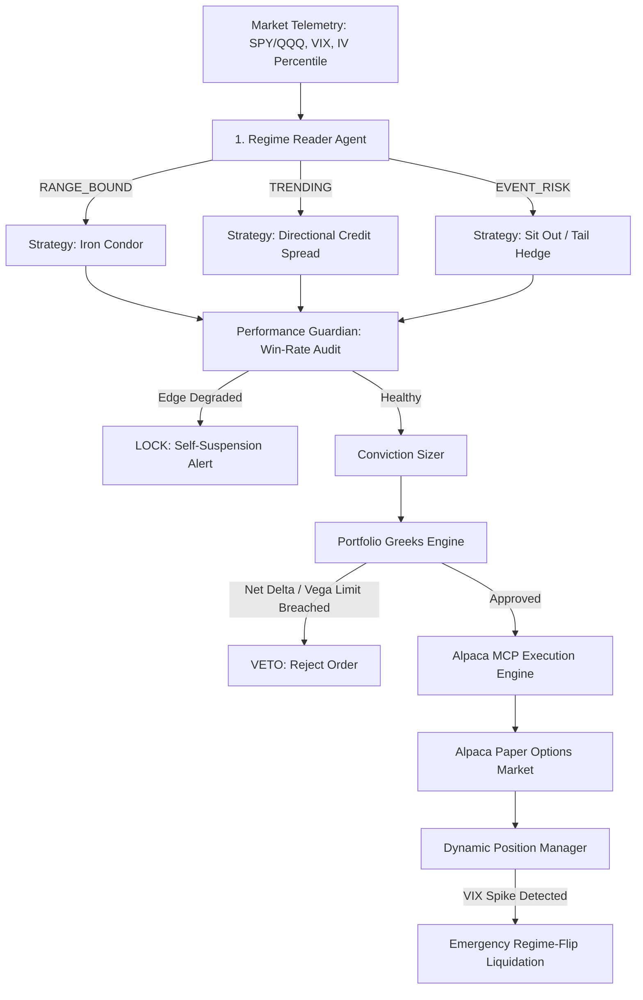

# 🦅 THETA HAWK: The Regime-Aware Options Desk Agent

> **Alpaca AI Trading Agents Hackathon Submission**  
> *"An autonomous options desk that reads the environment, adapts its strategy, sizes by conviction, manages the whole book, and knows when to stop."*

[](https://alpaca.markets)
[](https://github.com/alpacahq/alpaca-mcp-server)
[](https://python.org)
[](https://streamlit.io)

---

## 🎯 Executive Summary & The Pitch

Most trading bots in this hackathon fall into one of two fatal traps:
1. **Per-Trade Blindness:** They check risk on a single trade (e.g. "risk max 5%"), but ignore **aggregate book exposure**. Five individually safe bullish trades leave the account dangerously overleveraged to a market downturn.
2. **Reckless Autopilot:** Naive bots have no self-awareness. When market volatility shifts or theoretical edge decays, they blindly keep trading until the account blows up.

**THETA HAWK is the only agent in this hackathon that knows when it is wrong.**  
It monitors its own trailing win rate against statistical expectation, force-closes positions when the market regime changes underneath it, and enforces hard, mathematical portfolio-level Greeks caps before any order reaches the broker.

---

## 🏛️ System Architecture



---

## 💎 The 3 Verified Differentiators (Why THETA HAWK Wins)

### 1. Portfolio-Level Greeks Gate (`risk/portfolio_greeks_gate.py`)
* **What it does:** Computes real-time aggregate **Net Delta ($\Delta$)** and **Net Vega ($\nu$)** across the *entire book*.
* **The Gate:** Even if a bull put spread has a 90% probability of profit, if adding it pushes aggregate portfolio Delta past **$\pm0.25$**, the engine **vetoes or downsizes the trade instantly**.

### 2. Regime-Flip Mid-Trade Forced Exit (`risk/regime_flip_exit.py`)
* **What it does:** Standard bots exit only on fixed stop-loss (-15%) or take-profit (+50%).
* **The Difference:** If the market regime flips to `EVENT_RISK` (e.g., an unexpected VIX spike >12% or macro shock) while a spread is open, THETA HAWK **liquidates immediately for a minor scratch**, eliminating catastrophic tail-risk before volatility crushes the wings.

### 3. Self-Awareness Layer & Win-Rate Lock (`risk/self_suspension.py`)
* **What it does:** Continuously computes rolling binomial Z-scores of realized win-rate versus theoretical edge (70%).
* **The Kill-Switch:** If performance degrades outside statistical variance, it **autonomously suspends trading** and posts a transparent audit log:
  > *"TRADING SUSPENDED: Win-rate degradation detected. Realized win rate (20.0%) dropped below theoretical floor (70.0%). Fiduciary lock engaged."*

---

## 🚀 Quickstart & Setup

### 1. Clone & Install Dependencies
```bash
git clone https://github.com/RABNEER/ThetaHawk.git
cd ThetaHawk
python -m pip install -r requirements.txt
```

### 2. Configure Environment (`.env`)
```env
ALPACA_API_KEY=your_paper_key
ALPACA_SECRET_KEY=your_paper_secret
ALPACA_PAPER=true
ALPACA_BASE_URL=https://paper-api.alpaca.markets
ALPACA_ACCOUNT_NUMBER=your_account_number
GEMINI_API_KEY=your_gemini_key
```

### 3. Run the Autonomous Trader
```bash
# Execute a single 5-step analysis and trade cycle
python main.py --once

# Launch the full Streamlit Options Desk Dashboard
python main.py --dashboard
```

---

## 🎬 5-Minute Video Pitch Script & Visual Triggers

The dashboard at `http://localhost:8501` includes dedicated buttons to trigger all required demo moments on demand:
1. **(0:00 - 0:45) The Problem:** Show naive bots taking repeated directional risk vs. THETA HAWK's regime awareness.
2. **(0:45 - 1:45) Regime Shift in Action:** Show the live regime gauge classifying market conditions and selecting the corresponding defined-risk structure.
3. **(1:45 - 2:45) The Greeks Firewall VETO:** Click **"Trigger Greeks Breach"** ➔ Watch the red alert: `[VETO] Proposed trade would cause Net Delta (+0.31) to breach limit (±0.25)`.
4. **(2:45 - 3:45) The Regime-Flip Exit:** Click **"Trigger Regime Flip"** ➔ Watch open spreads force-close cleanly when VIX spikes.
5. **(3:45 - 4:30) Self-Suspension Lock:** Click **"Simulate Edge Decay"** ➔ Watch the purple fiduciary lock engage, halting all entries.
6. **(4:30 - 5:00) Closing:** The one-sentence pitch and Alpaca MCP architecture.

---

## 📊 Evaluation Rubric Alignment

| Criteria | How THETA HAWK Delivers |
| :--- | :--- |
| **Application of Technology** | Official Alpaca MCP integration, pure-Python Black-Scholes Greeks engine (`data/greeks_engine.py`), and Gemini reasoning. |
| **Business Value** | Solves the #1 reason systematic options desks fail: unmonitored aggregate Greeks and inability to self-halt during edge decay. |
| **Originality** | Differentiated from the common "prompt-only verifier" submissions by implementing an institutional-grade risk firewall. |
| **Presentation Quality** | Real-time Streamlit desk with live Greeks gauges, visual alert banners, and 1-click hackathon demo triggers. |

---

*Built with precision for the Alpaca AI Trading Agents Hackathon.*
